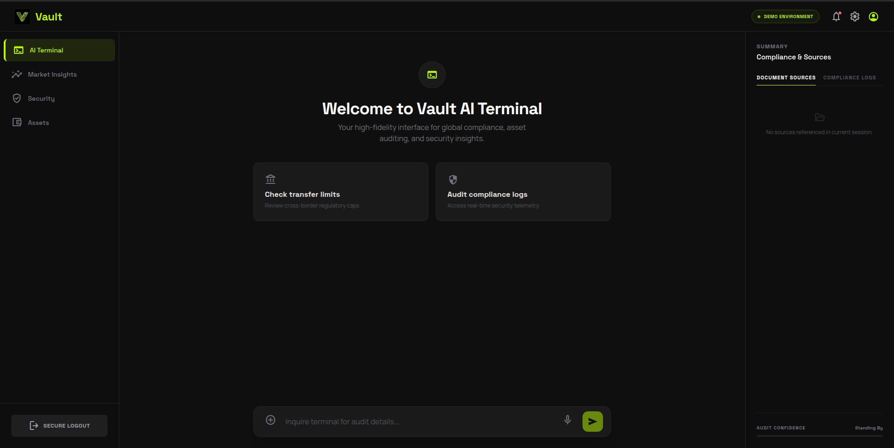

# Vault AI Terminal 🔒

> **Visual Preview**: *(Upload your screenshot here to show recruiters the stunning Vault UI)*
> 

Vault AI Terminal is a high-fidelity, highly secure Retrieval-Augmented Generation (RAG) assistant designed for enterprise compliance, auditing, and secure knowledge retrieval. 

Moving beyond standard chat interfaces, Vault introduces a professional 3-column dashboard equipped with real-time compliance logging, encrypted JWT authentication, a local vector store, and a beautiful React front-end inspired by top-tier SaaS platforms (like Stripe, Plaid, and Linear).

---

## ⚡ Key Features

- **End-to-End Authentication**: Full OAuth2 JWT implementation leveraging FastAPI dependencies and SQLite.
- **RAG Powered AI**: Answers questions purely from the loaded Markdown document corpus. If it doesn't know, it tells you. Uses HuggingFace embeddings (`all-MiniLM-L6-v2`) and Groq (`llama-3.1-8b-instant`).
- **Real-Time Confidence Scoring**: The AI calculates and displays an "Audit Confidence" percentage based on cosine similarity logic, marking its certainty from 0% to 100%.
- **Live Terminal Logging**: A simulated but functional compliance log readout to monitor system tasks (e.g. LLM instantiation, PII purges, cache checking).ted Generation (RAG) assistant designed for enterprise compliance, auditing, and secure knowledge retrieval. 

Moving beyond standard chat interfaces, Vault introduces a professional 3-column dashboard equipped with real-time compliance logging, encrypted JWT authentication, a local vector store, and a beautiful React front-end inspired by top-tier SaaS platforms (like Stripe, Plaid, and Linear).

---
- **Stunning UI/UX**: Frosted glass forms, responsive neon interactions, and a professional "Demo Environment" indicator.

---

## 🏗️ Architecture

- **Frontend**: React, Vite, Tailwind CSS v4, `react-markdown` plugin.
- **Backend API**: Python, FastAPI, SQLAlchemy (SQLite ORM), JWT/bcrypt integration.
- **AI Core**: LangChain, Groq API, ChromaDB (Local Vector Store).

---

## 🚀 Quickstart Guide

### 1. Prerequisites
- Python 3.10+
- Node.js v18+
- Groq API Key (Free tier available at [console.groq.com](https://console.groq.com))

### 2. Configure Environment Secrets
Rename `.env.example` to `.env` in the root directory.
```bash
cp .env.example .env
```
Fill out the required keys (specifically `GROQ_API_KEY` and `JWT_SECRET_KEY`).

### 3. Start the Backend
Navigate to the `backend` directory, install requirements, and run the FastAPI server.
```bash
cd backend
python -m venv .venv
source .venv/bin/activate  # Or .venv\Scripts\activate on Windows
pip install -r requirements.txt

# Run the server
uvicorn app.main:app --reload --port 8001
```

> **Note**: On the first start, the application will initialize the SQLite database (`vault_users.db`), seed an Administrator account, process the markdown files located in `backend/data/docs`, and insert them into the local Chroma vector store.

### 4. Start the Frontend
In a new terminal window, navigate to the `frontend` directory.
```bash
cd frontend
npm install
npm run dev
```

The terminal will be locally hosted on `http://locted Generation (RAG) assistant designed for enterprise compliance, auditing, and secure knowledge retrieval. 

Moving beyond standard chat interfaces, Vault introduces a professional 3-column dashboard equipped with real-time compliance logging, encrypted JWT authentication, a local vector store, and a beautiful React front-end inspired by top-tier SaaS platforms (like Stripe, Plaid, and Linear).

---alhost:5173`. 

### 5. Accessing the System
By default, the SQLite database is seeded with a Master Administrator account.
- **Email**: `admin@vault.com`
- **Password**: `VaultSecure2026!`

---

## 📂 Repository Structure

```
├── backend/
│   ├── app/                # FastAPI application logic (main.py, auth.py, database.py)
│   ├── data/docs/          # Place your Markdown The terminal will be locally hosted on `http://locted Generation (RAG) assistant designed for enterprise context files here
│   ├── chroma-data/        # Auto-generated Vector database (Ignored by Git)
│   ├── requirements.txt
├── frontend/
│   ├── public/             # Static assets (logo)
│   ├── src/                # React App components (App.jsx, index.css)
│   ├── package.json
├── .env                    # Secret environment file (Ignored by Git)
├── .gitignore              
└── README.md
```

## Security Notice
This mock application is built for portfolio and demonstration purposes. While it includes legitimate JWT validation and BCrypt hashing, always conduct professional security audits before deploying an enterprise application into actual production.
